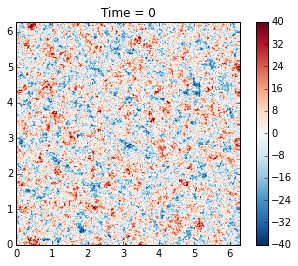
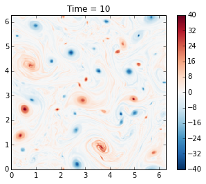
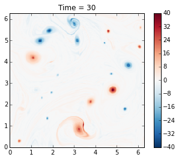
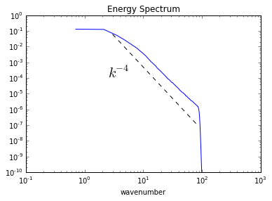
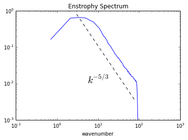

Barotropic Model
================

Here will will use pyqg to reproduce the results of the paper: J. C.
Mcwilliams (1984). The emergence of isolated coherent vortices in
turbulent flow. Journal of Fluid Mechanics, 146, pp 21-43
`doi:10.1017/S0022112084001750 <http://dx.doi.org/10.1017/S0022112084001750>`__

.. code:: python

    import numpy as np
    import matplotlib.pyplot as plt
    %matplotlib inline
    import pyqg

McWilliams performed freely-evolving 2D turbulence
(:math:`R_d = \infty`, :math:`\beta =0`) experiments on a
:math:`2\pi\times 2\pi` periodic box.

.. code:: python

    # create the model object
    m = pyqg.BTModel(L=2.*np.pi, nx=256, 
                     beta=0., H=1., rek=0., rd=None,
                     tmax=40, dt=0.001, taveint=1,
                     ntd=4)
    # in this example we used ntd=4, four threads
    # if your machine has more (or fewer) cores available, you could try changing it

Initial condition
-----------------

The initial condition is random, with a prescribed spectrum

.. math::

   |\hat{\psi}|^2 = A \,\kappa^{-1}\left[1 + \left(\frac{\kappa}{6}\right)^4\right]^{-1}\,,

where :math:`\kappa` is the wavenumber magnitude. The constant A is
determined so that the initial energy is :math:`KE = 0.5`.

.. code:: python

    # generate McWilliams 84 IC condition
    
    fk = m.wv != 0
    ckappa = np.zeros_like(m.wv2)
    ckappa[fk] = np.sqrt( m.wv2[fk]*(1. + (m.wv2[fk]/36.)**2) )**-1
    
    nhx,nhy = m.wv2.shape
    
    Pi_hat = np.random.randn(nhx,nhy)*ckappa +1j*np.random.randn(nhx,nhy)*ckappa
    
    Pi = m.ifft( Pi_hat[np.newaxis,:,:] )
    Pi = Pi - Pi.mean()
    Pi_hat = m.fft( Pi )
    KEaux = m.spec_var( m.wv*Pi_hat )
    
    pih = ( Pi_hat/np.sqrt(KEaux) )
    qih = -m.wv2*pih
    qi = m.ifft(qih)

.. code:: python

    # initialize the model with that initial condition
    m.set_q(qi)

.. code:: python

    # define a quick function for plotting and visualize the initial condition
    def plot_q(m, qmax=40):
        fig, ax = plt.subplots()
        pc = ax.pcolormesh(m.x,m.y,m.q.squeeze(), cmap='RdBu_r')
        pc.set_clim([-qmax, qmax])
        ax.set_xlim([0, 2*np.pi])
        ax.set_ylim([0, 2*np.pi]);
        ax.set_aspect(1)
        plt.colorbar(pc)
        plt.title('Time = %g' % m.t)
        plt.show()
    
    plot_q(m)

Runing the model
----------------

Here we demonstrate how to use the ``run_with_snapshots`` feature to
periodically stop the model and perform some action (in this case,
visualization).

.. code:: python

    for _ in m.run_with_snapshots(tsnapstart=0, tsnapint=10):
        plot_q(m)

.. parsed-literal::

    t=               1, tc=      1000: cfl=0.104428, ke=0.496432737
    t=               1, tc=      2000: cfl=0.110651, ke=0.495084591
    t=               2, tc=      3000: cfl=0.101385, ke=0.494349348
    t=               3, tc=      4000: cfl=0.113319, ke=0.493862801
    t=               5, tc=      5000: cfl=0.112978, ke=0.493521035
    t=               6, tc=      6000: cfl=0.101435, ke=0.493292057
    t=               7, tc=      7000: cfl=0.092574, ke=0.493114415
    t=               8, tc=      8000: cfl=0.096229, ke=0.492987232
    t=               9, tc=      9000: cfl=0.097924, ke=0.492899499

.. parsed-literal::

    t=               9, tc=     10000: cfl=0.103278, ke=0.492830631
    t=              10, tc=     11000: cfl=0.102686, ke=0.492775849
    t=              11, tc=     12000: cfl=0.099865, ke=0.492726644
    t=              12, tc=     13000: cfl=0.110933, ke=0.492679673
    t=              13, tc=     14000: cfl=0.102899, ke=0.492648562
    t=              14, tc=     15000: cfl=0.102052, ke=0.492622263
    t=              15, tc=     16000: cfl=0.106399, ke=0.492595449
    t=              16, tc=     17000: cfl=0.122508, ke=0.492569708
    t=              17, tc=     18000: cfl=0.120618, ke=0.492507272
    t=              19, tc=     19000: cfl=0.103734, ke=0.492474633

.. image:: barotropic_files/barotropic_9_3.png

.. parsed-literal::

    t=              20, tc=     20000: cfl=0.113210, ke=0.492452605
    t=              21, tc=     21000: cfl=0.095246, ke=0.492439588
    t=              22, tc=     22000: cfl=0.092449, ke=0.492429553
    t=              23, tc=     23000: cfl=0.115412, ke=0.492419773
    t=              24, tc=     24000: cfl=0.125958, ke=0.492407434
    t=              25, tc=     25000: cfl=0.098588, ke=0.492396021
    t=              26, tc=     26000: cfl=0.103689, ke=0.492387002
    t=              27, tc=     27000: cfl=0.103893, ke=0.492379606
    t=              28, tc=     28000: cfl=0.108417, ke=0.492371082
    t=              29, tc=     29000: cfl=0.112969, ke=0.492361675

.. parsed-literal::

    t=              30, tc=     30000: cfl=0.127132, ke=0.492352666
    t=              31, tc=     31000: cfl=0.122900, ke=0.492331664
    t=              32, tc=     32000: cfl=0.110486, ke=0.492317502
    t=              33, tc=     33000: cfl=0.101901, ke=0.492302225
    t=              34, tc=     34000: cfl=0.099996, ke=0.492294952
    t=              35, tc=     35000: cfl=0.106513, ke=0.492290743
    t=              36, tc=     36000: cfl=0.121426, ke=0.492286228
    t=              37, tc=     37000: cfl=0.125573, ke=0.492283246
    t=              38, tc=     38000: cfl=0.108975, ke=0.492280378
    t=              38, tc=     39000: cfl=0.110105, ke=0.492278000

.. image:: barotropic_files/barotropic_9_7.png

.. parsed-literal::

    t=              39, tc=     40000: cfl=0.104794, ke=0.492275760

The genius of McWilliams (1984) was that he showed that the initial
random vorticity field organizes itself into strong coherent vortices.
This is true in significant part of the parameter space. This was
previously suspected but unproven, mainly because people did not have
computer resources to run the simulation long enough. Thirty years later
we can perform such simulations in a couple of minutes on a laptop!

Also, note that the energy is nearly conserved, as it should be, and
this is a nice test of the model.

Plotting spectra
----------------

.. code:: python

    energy = m.get_diagnostic('KEspec')
    enstrophy = m.get_diagnostic('Ensspec')

.. code:: python

    # this makes it easy to calculate an isotropic spectrum
    from pyqg import diagnostic_tools as tools
    kr, energy_iso = tools.calc_ispec(m,energy.squeeze())
    _, enstrophy_iso = tools.calc_ispec(m,enstrophy.squeeze())

.. code:: python

    ks = np.array([3.,80])
    es = 5*ks**-4
    plt.loglog(kr,energy_iso)
    plt.loglog(ks,es,'k--')
    plt.text(2.5,.0001,r'$k^{-4}$',fontsize=20)
    plt.ylim(1.e-10,1.e0)
    plt.xlabel('wavenumber')
    plt.title('Energy Spectrum')

.. parsed-literal::

    <matplotlib.text.Text at 0x10c1b1a90>

.. code:: python

    ks = np.array([3.,80])
    es = 5*ks**(-5./3)
    plt.loglog(kr,enstrophy_iso)
    plt.loglog(ks,es,'k--')
    plt.text(5.5,.01,r'$k^{-5/3}$',fontsize=20)
    plt.ylim(1.e-3,1.e0)
    plt.xlabel('wavenumber')
    plt.title('Enstrophy Spectrum')

.. parsed-literal::

    <matplotlib.text.Text at 0x10b5d2f50>

