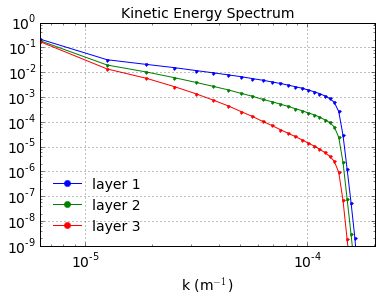
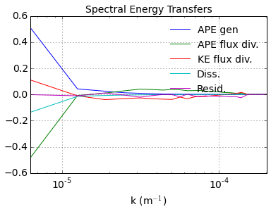

Fully developed baroclinic instability of a 3-layer flow
========================================================

.. code:: python

    import numpy as np
    from numpy import pi
    from matplotlib import pyplot as plt
    %matplotlib inline
    
    import pyqg

.. parsed-literal::

    Vendor:  Continuum Analytics, Inc.
    Package: mkl
    Message: trial mode expires in 28 days
    Vendor:  Continuum Analytics, Inc.
    Package: mkl
    Message: trial mode expires in 28 days
    Vendor:  Continuum Analytics, Inc.
    Package: mkl
    Message: trial mode expires in 28 days

Set up
======

.. code:: python

    L =  1000.e3     # length scale of box    [m]
    Ld = 15.e3       # deformation scale      [m]
    kd = 1./Ld       # deformation wavenumber [m^-1]
    Nx = 64          # number of grid points
    
    H1 = 500.        # layer 1 thickness  [m]
    H2 = 1750.       # layer 2 
    H3 = 1750.       # layer 3 
    
    U1 = 0.05          # layer 1 zonal velocity [m/s]
    U2 = 0.01         # layer 2
    U3 = 0.00         # layer 3
    
    rho1 = 1025.
    rho2 = 1025.275
    rho3 = 1025.640
    
    rek = 1.e-7       # linear bottom drag coeff.  [s^-1]
    f0  = 0.0001236812857687059 # coriolis param [s^-1]
    beta = 1.2130692965249345e-11 # planetary vorticity gradient [m^-1 s^-1]
    
    Ti = Ld/(abs(U1))  # estimate of most unstable e-folding time scale [s]
    dt = Ti/500.   # time-step [s]
    tmax = 300*Ti      # simulation time [s]

.. code:: python

    m = pyqg.LayeredModel(nx=Nx, nz=3, U = [U1,U2,U3],V = [0.,0.,0.],L=L,f=f0,beta=beta,
                             H = [H1,H2,H3], rho=[rho1,rho2,rho3],rek=rek,
                            dt=dt,tmax=tmax, twrite=5000, tavestart=Ti*300)

.. parsed-literal::

    2015-10-25 21:49:12,357 - pyqg.model - INFO -  Logger initialized
    2015-10-25 21:49:12,416 - pyqg.model - INFO -  Kernel initialized

Initial condition
=================

.. code:: python

    sig = 1.e-7
    qi = sig*np.vstack([np.random.randn(m.nx,m.ny)[np.newaxis,],
                        np.random.randn(m.nx,m.ny)[np.newaxis,],
                        np.random.randn(m.nx,m.ny)[np.newaxis,]])
    m.set_q(qi)

Run the model
=============

.. code:: python

    m.run()

.. parsed-literal::

    2015-10-25 21:49:22,740 - pyqg.model - INFO -  Step: 5000, Time: 3.000000e+06, KE: 7.809761e-07, CFL: 0.002064
    2015-10-25 21:49:29,866 - pyqg.model - INFO -  Step: 10000, Time: 6.000000e+06, KE: 1.294099e-05, CFL: 0.002536
    2015-10-25 21:49:37,268 - pyqg.model - INFO -  Step: 15000, Time: 9.000000e+06, KE: 3.543947e-04, CFL: 0.006603
    2015-10-25 21:49:44,638 - pyqg.model - INFO -  Step: 20000, Time: 1.200000e+07, KE: 3.264680e-03, CFL: 0.016581
    2015-10-25 21:49:51,972 - pyqg.model - INFO -  Step: 25000, Time: 1.500000e+07, KE: 8.010529e-03, CFL: 0.026138
    2015-10-25 21:49:59,509 - pyqg.model - INFO -  Step: 30000, Time: 1.800000e+07, KE: 1.684268e-02, CFL: 0.039642
    2015-10-25 21:50:06,902 - pyqg.model - INFO -  Step: 35000, Time: 2.100000e+07, KE: 3.456753e-02, CFL: 0.048855
    2015-10-25 21:50:14,142 - pyqg.model - INFO -  Step: 40000, Time: 2.400000e+07, KE: 7.084024e-02, CFL: 0.072394
    2015-10-25 21:50:21,186 - pyqg.model - INFO -  Step: 45000, Time: 2.700000e+07, KE: 1.247350e-01, CFL: 0.073444
    2015-10-25 21:50:28,501 - pyqg.model - INFO -  Step: 50000, Time: 3.000000e+07, KE: 1.813794e-01, CFL: 0.097114
    2015-10-25 21:50:35,571 - pyqg.model - INFO -  Step: 55000, Time: 3.300000e+07, KE: 2.636245e-01, CFL: 0.084097
    2015-10-25 21:50:42,814 - pyqg.model - INFO -  Step: 60000, Time: 3.600000e+07, KE: 4.129393e-01, CFL: 0.152460
    2015-10-25 21:50:50,198 - pyqg.model - INFO -  Step: 65000, Time: 3.900000e+07, KE: 4.847927e-01, CFL: 0.107015
    2015-10-25 21:50:57,357 - pyqg.model - INFO -  Step: 70000, Time: 4.200000e+07, KE: 7.404359e-01, CFL: 0.136182
    2015-10-25 21:51:04,535 - pyqg.model - INFO -  Step: 75000, Time: 4.500000e+07, KE: 9.254192e-01, CFL: 0.155382
    2015-10-25 21:51:11,317 - pyqg.model - INFO -  Step: 80000, Time: 4.800000e+07, KE: 1.025710e+00, CFL: 0.135584
    2015-10-25 21:51:18,730 - pyqg.model - INFO -  Step: 85000, Time: 5.100000e+07, KE: 1.030813e+00, CFL: 0.130809
    2015-10-25 21:51:26,116 - pyqg.model - INFO -  Step: 90000, Time: 5.400000e+07, KE: 1.270087e+00, CFL: 0.167862
    2015-10-25 21:51:33,085 - pyqg.model - INFO -  Step: 95000, Time: 5.700000e+07, KE: 1.791460e+00, CFL: 0.176772
    2015-10-25 21:51:39,784 - pyqg.model - INFO -  Step: 100000, Time: 6.000000e+07, KE: 1.644498e+00, CFL: 0.131095
    2015-10-25 21:51:46,476 - pyqg.model - INFO -  Step: 105000, Time: 6.300000e+07, KE: 1.421885e+00, CFL: 0.127148
    2015-10-25 21:51:53,167 - pyqg.model - INFO -  Step: 110000, Time: 6.600000e+07, KE: 1.183883e+00, CFL: 0.110700
    2015-10-25 21:51:59,850 - pyqg.model - INFO -  Step: 115000, Time: 6.900000e+07, KE: 9.889258e-01, CFL: 0.115063
    2015-10-25 21:52:06,896 - pyqg.model - INFO -  Step: 120000, Time: 7.200000e+07, KE: 8.383714e-01, CFL: 0.105721
    2015-10-25 21:52:13,874 - pyqg.model - INFO -  Step: 125000, Time: 7.500000e+07, KE: 7.619532e-01, CFL: 0.119120
    2015-10-25 21:52:20,689 - pyqg.model - INFO -  Step: 130000, Time: 7.800000e+07, KE: 1.096286e+00, CFL: 0.153684
    2015-10-25 21:52:27,420 - pyqg.model - INFO -  Step: 135000, Time: 8.100000e+07, KE: 1.342043e+00, CFL: 0.185609
    2015-10-25 21:52:34,127 - pyqg.model - INFO -  Step: 140000, Time: 8.400000e+07, KE: 1.413888e+00, CFL: 0.132139
    2015-10-25 21:52:40,835 - pyqg.model - INFO -  Step: 145000, Time: 8.700000e+07, KE: 1.151289e+00, CFL: 0.103622

A snapshot and some diagnostics
===============================

.. code:: python

    plt.figure(figsize=(18,4))
    
    plt.subplot(131)
    plt.pcolormesh(m.x/m.rd,m.y/m.rd,(m.q[0,]+m.Qy[0]*m.y)/(U1/Ld),cmap='Spectral_r')
    plt.xlabel(r'$x/L_d$')
    plt.ylabel(r'$y/L_d$')
    plt.colorbar()
    plt.title('Layer 1 PV')
    
    plt.subplot(132)
    plt.pcolormesh(m.x/m.rd,m.y/m.rd,(m.q[1,]+m.Qy[1]*m.y)/(U1/Ld),cmap='Spectral_r')
    plt.xlabel(r'$x/L_d$')
    plt.ylabel(r'$y/L_d$')
    plt.colorbar()
    plt.title('Layer 2 PV')
    
    plt.subplot(133)
    plt.pcolormesh(m.x/m.rd,m.y/m.rd,(m.q[2,]+m.Qy[2]*m.y)/(U1/Ld),cmap='Spectral_r')
    plt.xlabel(r'$x/L_d$')
    plt.ylabel(r'$y/L_d$')
    plt.colorbar()
    plt.title('Layer 3 PV')

.. parsed-literal::

    <matplotlib.text.Text at 0x111a11e50>

.. parsed-literal::

    /Users/crocha/anaconda/lib/python2.7/site-packages/matplotlib/collections.py:590: FutureWarning: elementwise comparison failed; returning scalar instead, but in the future will perform elementwise comparison
      if self._edgecolors == str('face'):

.. image:: layered_files/layered_10_2.png

.. code:: python

    kespec_1 = m.get_diagnostic('KEspec')[0].sum(axis=0)
    kespec_2 = m.get_diagnostic('KEspec')[1].sum(axis=0)
    kespec_3 = m.get_diagnostic('KEspec')[2].sum(axis=0)
    
    
    plt.loglog( m.kk, kespec_1, '.-' )
    plt.loglog( m.kk, kespec_2, '.-' )
    plt.loglog( m.kk, kespec_3, '.-' )
    
    plt.legend(['layer 1','layer 2', 'layer 3'], loc='lower left')
    plt.ylim([1e-9,1e-0]); plt.xlim([m.kk.min(), m.kk.max()])
    plt.xlabel(r'k (m$^{-1}$)'); plt.grid()
    plt.title('Kinetic Energy Spectrum');

.. code:: python

    ebud = [ m.get_diagnostic('APEgenspec').sum(axis=0),
             m.get_diagnostic('APEflux').sum(axis=0),
             m.get_diagnostic('KEflux').sum(axis=0),
             -m.rek*(m.Hi[-1]/m.H)*m.get_diagnostic('KEspec')[1].sum(axis=0)*m.M**2 ]
    ebud.append(-np.vstack(ebud).sum(axis=0))
    ebud_labels = ['APE gen','APE flux div.','KE flux div.','Diss.','Resid.']
    [plt.semilogx(m.kk, term) for term in ebud]
    plt.legend(ebud_labels, loc='upper right')
    plt.xlim([m.kk.min(), m.kk.max()])
    plt.xlabel(r'k (m$^{-1}$)'); plt.grid()
    plt.title('Spectral Energy Transfers');

This simple example illustrate the classic phenomenology of baroclinic
turbulence. The APE generated through baroclinic instability is fluxed
towards deformation length scales, where it is converted into KE. The KE
the experiments and inverse cascade. The mechanical bottom drag
essentially removes the large scale KE.
