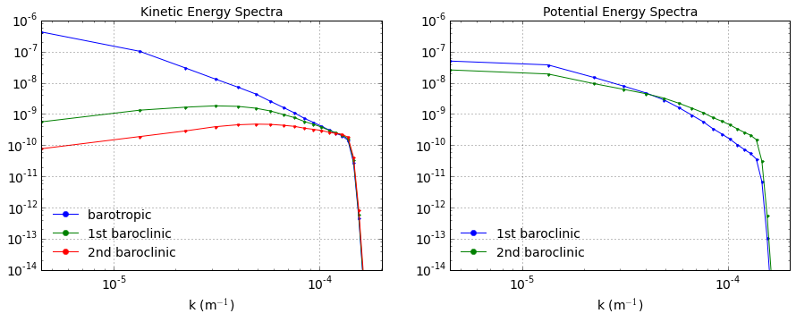

Fully developed baroclinic instability of a 3-layer flow
========================================================

.. code:: python

    import numpy as np
    from numpy import pi
    from matplotlib import pyplot as plt
    %matplotlib inline
    
    import pyqg
    from pyqg import diagnostic_tools as tools

.. parsed-literal::

    Vendor:  Continuum Analytics, Inc.
    Package: mkl
    Message: trial mode expires in 21 days
    Vendor:  Continuum Analytics, Inc.
    Package: mkl
    Message: trial mode expires in 21 days
    Vendor:  Continuum Analytics, Inc.
    Package: mkl
    Message: trial mode expires in 21 days

Set up
------

.. code:: python

    L =  1000.e3     # length scale of box    [m]
    Ld = 15.e3       # deformation scale      [m]
    kd = 1./Ld       # deformation wavenumber [m^-1]
    Nx = 64          # number of grid points
    
    H1 = 500.        # layer 1 thickness  [m]
    H2 = 1750.       # layer 2 
    H3 = 1750.       # layer 3 
    
    U1 = 0.05          # layer 1 zonal velocity [m/s]
    U2 = 0.025         # layer 2
    U3 = 0.00          # layer 3
    
    rho1 = 1025.
    rho2 = 1025.275
    rho3 = 1025.640
    
    rek = 1.e-7       # linear bottom drag coeff.  [s^-1]
    f0  = 0.0001236812857687059 # coriolis param [s^-1]
    beta = 1.2130692965249345e-11 # planetary vorticity gradient [m^-1 s^-1]
    
    Ti = Ld/(abs(U1))  # estimate of most unstable e-folding time scale [s]
    dt = Ti/200.   # time-step [s]
    tmax = 300*Ti      # simulation time [s]

.. code:: python

    m = pyqg.LayeredModel(nx=Nx, nz=3, U = [U1,U2,U3],V = [0.,0.,0.],L=L,f=f0,beta=beta,
                             H = [H1,H2,H3], rho=[rho1,rho2,rho3],rek=rek,
                            dt=dt,tmax=tmax, twrite=5000, tavestart=Ti*10)

.. parsed-literal::

    2015-11-01 09:24:48,899 - pyqg.model - INFO -  Logger initialized
    2015-11-01 09:24:48,976 - pyqg.model - INFO -  Kernel initialized

Initial condition
-----------------

.. code:: python

    sig = 1.e-7
    qi = sig*np.vstack([np.random.randn(m.nx,m.ny)[np.newaxis,],
                        np.random.randn(m.nx,m.ny)[np.newaxis,],
                        np.random.randn(m.nx,m.ny)[np.newaxis,]])
    m.set_q(qi)

Run the model
-------------

.. code:: python

    m.run()

.. parsed-literal::

    2015-11-01 09:24:56,724 - pyqg.model - INFO -  Step: 5000, Time: 7.500000e+06, KE: 2.943601e-06, CFL: 0.005405
    2015-11-01 09:25:04,047 - pyqg.model - INFO -  Step: 10000, Time: 1.500000e+07, KE: 2.458295e-04, CFL: 0.009907
    2015-11-01 09:25:11,367 - pyqg.model - INFO -  Step: 15000, Time: 2.250000e+07, KE: 7.871924e-03, CFL: 0.052224
    2015-11-01 09:25:18,647 - pyqg.model - INFO -  Step: 20000, Time: 3.000000e+07, KE: 2.883665e-02, CFL: 0.097805
    2015-11-01 09:25:25,984 - pyqg.model - INFO -  Step: 25000, Time: 3.750000e+07, KE: 6.801730e-02, CFL: 0.128954
    2015-11-01 09:25:33,610 - pyqg.model - INFO -  Step: 30000, Time: 4.500000e+07, KE: 1.381786e-01, CFL: 0.162363
    2015-11-01 09:25:41,222 - pyqg.model - INFO -  Step: 35000, Time: 5.250000e+07, KE: 2.030859e-01, CFL: 0.232705
    2015-11-01 09:25:48,808 - pyqg.model - INFO -  Step: 40000, Time: 6.000000e+07, KE: 2.863686e-01, CFL: 0.212858
    2015-11-01 09:25:56,022 - pyqg.model - INFO -  Step: 45000, Time: 6.750000e+07, KE: 2.558977e-01, CFL: 0.212194
    2015-11-01 09:26:03,663 - pyqg.model - INFO -  Step: 50000, Time: 7.500000e+07, KE: 1.979363e-01, CFL: 0.172992
    2015-11-01 09:26:11,409 - pyqg.model - INFO -  Step: 55000, Time: 8.250000e+07, KE: 1.755793e-01, CFL: 0.170431

Snapshots
---------

.. code:: python

    plt.figure(figsize=(18,4))
    
    plt.subplot(131)
    plt.pcolormesh(m.x/m.rd,m.y/m.rd,(m.q[0,]+m.Qy[0]*m.y)/(U1/Ld),cmap='Spectral_r')
    plt.xlabel(r'$x/L_d$')
    plt.ylabel(r'$y/L_d$')
    plt.colorbar()
    plt.title('Layer 1 PV')
    
    plt.subplot(132)
    plt.pcolormesh(m.x/m.rd,m.y/m.rd,(m.q[1,]+m.Qy[1]*m.y)/(U1/Ld),cmap='Spectral_r')
    plt.xlabel(r'$x/L_d$')
    plt.ylabel(r'$y/L_d$')
    plt.colorbar()
    plt.title('Layer 2 PV')
    
    plt.subplot(133)
    plt.pcolormesh(m.x/m.rd,m.y/m.rd,(m.q[2,]+m.Qy[2]*m.y)/(U1/Ld),cmap='Spectral_r')
    plt.xlabel(r'$x/L_d$')
    plt.ylabel(r'$y/L_d$')
    plt.colorbar()
    plt.title('Layer 3 PV')

.. parsed-literal::

    <matplotlib.text.Text at 0x1119c4c50>

.. parsed-literal::

    /Users/crocha/anaconda/lib/python2.7/site-packages/matplotlib/collections.py:590: FutureWarning: elementwise comparison failed; returning scalar instead, but in the future will perform elementwise comparison
      if self._edgecolors == str('face'):

.. image:: layered_files/layered_10_2.png

pyqg has a built-in method that computes the vertical modes.

.. code:: python

    print "The first baroclinic deformation radius is", m.radii[1]/1.e3, "km"
    print "The second baroclinic deformation radius is", m.radii[2]/1.e3, "km"

.. parsed-literal::

    The first baroclinic deformation radius is 15.375382786 km
    The second baroclinic deformation radius is 7.975516272 km

We can project the solution onto the modes

.. code:: python

    pn = m.modal_projection(m.p)

.. code:: python

    plt.figure(figsize=(18,4))
    
    plt.subplot(131)
    plt.pcolormesh(m.x/m.rd,m.y/m.rd,pn[0]/(U1*Ld),cmap='Spectral_r')
    plt.xlabel(r'$x/L_d$')
    plt.ylabel(r'$y/L_d$')
    plt.colorbar()
    plt.title('Barotropic streamfunction')
    
    plt.subplot(132)
    plt.pcolormesh(m.x/m.rd,m.y/m.rd,pn[1]/(U1*Ld),cmap='Spectral_r')
    plt.xlabel(r'$x/L_d$')
    plt.ylabel(r'$y/L_d$')
    plt.colorbar()
    plt.title('1st baroclinic streamfunction')
    
    plt.subplot(133)
    plt.pcolormesh(m.x/m.rd,m.y/m.rd,pn[2]/(U1*Ld),cmap='Spectral_r')
    plt.xlabel(r'$x/L_d$')
    plt.ylabel(r'$y/L_d$')
    plt.colorbar()
    plt.title('2nd baroclinic streamfunction')

.. parsed-literal::

    <matplotlib.text.Text at 0x11273f350>

.. image:: layered_files/layered_15_1.png

Diagnostics
-----------

.. code:: python

    kr, kespec_1 = tools.calc_ispec(m,m.get_diagnostic('KEspec')[0])
    _, kespec_2 = tools.calc_ispec(m,m.get_diagnostic('KEspec')[1])
    _, kespec_3 = tools.calc_ispec(m,m.get_diagnostic('KEspec')[2])
    
    plt.loglog( kr, kespec_1, '.-' )
    plt.loglog( kr, kespec_2, '.-' )
    plt.loglog( kr, kespec_3, '.-' )
    
    plt.legend(['layer 1','layer 2', 'layer 3'], loc='lower left')
    plt.ylim([1e-14,1e-6]); plt.xlim([m.kk.min(), m.kk.max()])
    plt.xlabel(r'k (m$^{-1}$)'); plt.grid()
    plt.title('Kinetic Energy Spectrum');

.. image:: layered_files/layered_17_0.png

By default the modal KE and PE spectra are also calculated

.. code:: python

    kr, modal_kespec_1 = tools.calc_ispec(m,m.get_diagnostic('KEspec_modal')[0])
    _,  modal_kespec_2 = tools.calc_ispec(m,m.get_diagnostic('KEspec_modal')[1])
    _,  modal_kespec_3 = tools.calc_ispec(m,m.get_diagnostic('KEspec_modal')[2])
    
    _,  modal_pespec_2 = tools.calc_ispec(m,m.get_diagnostic('PEspec_modal')[0])
    _,  modal_pespec_3 = tools.calc_ispec(m,m.get_diagnostic('PEspec_modal')[1])

.. code:: python

    plt.figure(figsize=(15,5))
    
    plt.subplot(121)
    plt.loglog( kr, modal_kespec_1, '.-' )
    plt.loglog( kr, modal_kespec_2, '.-' )
    plt.loglog( kr, modal_kespec_3, '.-' )
    
    plt.legend(['barotropic ','1st baroclinic', '2nd baroclinic'], loc='lower left')
    plt.ylim([1e-14,1e-6]); plt.xlim([m.kk.min(), m.kk.max()])
    plt.xlabel(r'k (m$^{-1}$)'); plt.grid()
    plt.title('Kinetic Energy Spectra');
    
    
    plt.subplot(122)
    plt.loglog( kr, modal_pespec_2, '.-' )
    plt.loglog( kr, modal_pespec_3, '.-' )
    
    plt.legend(['1st baroclinic', '2nd baroclinic'], loc='lower left')
    plt.ylim([1e-14,1e-6]); plt.xlim([m.kk.min(), m.kk.max()])
    plt.xlabel(r'k (m$^{-1}$)'); plt.grid()
    plt.title('Potential Energy Spectra');

.. code:: python

    _, APEgenspec =  tools.calc_ispec(m,m.get_diagnostic('APEgenspec'))
    _, APEflux =  tools.calc_ispec(m,m.get_diagnostic('APEflux'))
    _, KEflux =   tools.calc_ispec(m,m.get_diagnostic('KEflux'))
    _, KEspec =   tools.calc_ispec(m,m.get_diagnostic('KEspec')[1]*m.M**2)
    
    ebud = [ APEgenspec,
             APEflux,
             KEflux,
             -m.rek*(m.Hi[-1]/m.H)*KEspec ]
    ebud.append(-np.vstack(ebud).sum(axis=0))
    ebud_labels = ['APE gen','APE flux div.','KE flux div.','Diss.','Resid.']
    [plt.semilogx(kr, term) for term in ebud]
    plt.legend(ebud_labels, loc='upper right')
    plt.xlim([m.kk.min(), m.kk.max()])
    plt.xlabel(r'k (m$^{-1}$)'); plt.grid()
    plt.title('Spectral Energy Transfers');

.. image:: layered_files/layered_21_0.png

The dynamics here is similar to the reference experiment of `Larichev &
Held
(1995) <http://journals.ametsoc.org/doi/pdf/10.1175/1520-0485%281995%29025%3C2285%3AEAAFIA%3E2.0.CO%3B2>`__.
The APE generated through baroclinic instability is fluxed towards
deformation length scales, where it is converted into KE. The KE the
experiments and inverse tranfer, cascading up to the scale of the
domain. The mechanical bottom drag essentially removes the large scale
KE.
