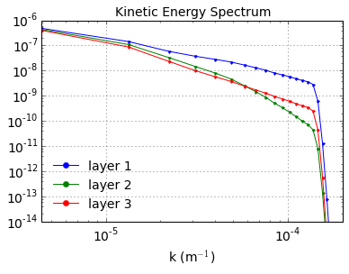

Fully developed baroclinic instability of a 3-layer flow
========================================================

.. code:: python

    import numpy as np
    from numpy import pi
    from matplotlib import pyplot as plt
    %matplotlib inline
    
    import pyqg

.. parsed-literal::

    Vendor:  Continuum Analytics, Inc.
    Package: mkl
    Message: trial mode expires in 22 days
    Vendor:  Continuum Analytics, Inc.
    Package: mkl
    Message: trial mode expires in 22 days
    Vendor:  Continuum Analytics, Inc.
    Package: mkl
    Message: trial mode expires in 22 days

Set up
======

.. code:: python

    L =  1000.e3     # length scale of box    [m]
    Ld = 15.e3       # deformation scale      [m]
    kd = 1./Ld       # deformation wavenumber [m^-1]
    Nx = 64          # number of grid points
    
    H1 = 500.        # layer 1 thickness  [m]
    H2 = 1750.       # layer 2 
    H3 = 1750.       # layer 3 
    
    U1 = 0.05          # layer 1 zonal velocity [m/s]
    U2 = 0.025         # layer 2
    U3 = 0.00          # layer 3
    
    rho1 = 1025.
    rho2 = 1025.275
    rho3 = 1025.640
    
    rek = 1.e-7       # linear bottom drag coeff.  [s^-1]
    f0  = 0.0001236812857687059 # coriolis param [s^-1]
    beta = 1.2130692965249345e-11 # planetary vorticity gradient [m^-1 s^-1]
    
    Ti = Ld/(abs(U1))  # estimate of most unstable e-folding time scale [s]
    dt = Ti/200.   # time-step [s]
    tmax = 300*Ti      # simulation time [s]

.. code:: python

    m = pyqg.LayeredModel(nx=Nx, nz=3, U = [U1,U2,U3],V = [0.,0.,0.],L=L,f=f0,beta=beta,
                             H = [H1,H2,H3], rho=[rho1,rho2,rho3],rek=rek,
                            dt=dt,tmax=tmax, twrite=5000, tavestart=Ti*10)

.. parsed-literal::

    2015-10-31 20:46:27,674 - pyqg.model - INFO -  Logger initialized
    2015-10-31 20:46:27,743 - pyqg.model - INFO -  Kernel initialized

Initial condition
=================

.. code:: python

    sig = 1.e-7
    qi = sig*np.vstack([np.random.randn(m.nx,m.ny)[np.newaxis,],
                        np.random.randn(m.nx,m.ny)[np.newaxis,],
                        np.random.randn(m.nx,m.ny)[np.newaxis,]])
    m.set_q(qi)

Run the model
=============

.. code:: python

    m.run()

.. parsed-literal::

    2015-10-31 20:46:35,461 - pyqg.model - INFO -  Step: 5000, Time: 7.500000e+06, KE: 3.031285e-06, CFL: 0.005523
    2015-10-31 20:46:43,220 - pyqg.model - INFO -  Step: 10000, Time: 1.500000e+07, KE: 2.739828e-04, CFL: 0.011262
    2015-10-31 20:46:51,022 - pyqg.model - INFO -  Step: 15000, Time: 2.250000e+07, KE: 9.408583e-03, CFL: 0.062950
    2015-10-31 20:46:58,740 - pyqg.model - INFO -  Step: 20000, Time: 3.000000e+07, KE: 3.752716e-02, CFL: 0.099449
    2015-10-31 20:47:06,509 - pyqg.model - INFO -  Step: 25000, Time: 3.750000e+07, KE: 9.344290e-02, CFL: 0.158044
    2015-10-31 20:47:14,373 - pyqg.model - INFO -  Step: 30000, Time: 4.500000e+07, KE: 1.581918e-01, CFL: 0.150727
    2015-10-31 20:47:22,635 - pyqg.model - INFO -  Step: 35000, Time: 5.250000e+07, KE: 2.302018e-01, CFL: 0.204099
    2015-10-31 20:47:30,323 - pyqg.model - INFO -  Step: 40000, Time: 6.000000e+07, KE: 2.999698e-01, CFL: 0.188181
    2015-10-31 20:47:38,000 - pyqg.model - INFO -  Step: 45000, Time: 6.750000e+07, KE: 3.947220e-01, CFL: 0.218937
    2015-10-31 20:47:46,096 - pyqg.model - INFO -  Step: 50000, Time: 7.500000e+07, KE: 4.528079e-01, CFL: 0.244699
    2015-10-31 20:47:54,058 - pyqg.model - INFO -  Step: 55000, Time: 8.250000e+07, KE: 3.766524e-01, CFL: 0.232231

A snapshot and some diagnostics
===============================

.. code:: python

    plt.figure(figsize=(18,4))
    
    plt.subplot(131)
    plt.pcolormesh(m.x/m.rd,m.y/m.rd,(m.q[0,]+m.Qy[0]*m.y)/(U1/Ld),cmap='Spectral_r')
    plt.xlabel(r'$x/L_d$')
    plt.ylabel(r'$y/L_d$')
    plt.colorbar()
    plt.title('Layer 1 PV')
    
    plt.subplot(132)
    plt.pcolormesh(m.x/m.rd,m.y/m.rd,(m.q[1,]+m.Qy[1]*m.y)/(U1/Ld),cmap='Spectral_r')
    plt.xlabel(r'$x/L_d$')
    plt.ylabel(r'$y/L_d$')
    plt.colorbar()
    plt.title('Layer 2 PV')
    
    plt.subplot(133)
    plt.pcolormesh(m.x/m.rd,m.y/m.rd,(m.q[2,]+m.Qy[2]*m.y)/(U1/Ld),cmap='Spectral_r')
    plt.xlabel(r'$x/L_d$')
    plt.ylabel(r'$y/L_d$')
    plt.colorbar()
    plt.title('Layer 3 PV')

.. parsed-literal::

    <matplotlib.text.Text at 0x111be1910>

.. parsed-literal::

    /Users/crocha/anaconda/lib/python2.7/site-packages/matplotlib/collections.py:590: FutureWarning: elementwise comparison failed; returning scalar instead, but in the future will perform elementwise comparison
      if self._edgecolors == str('face'):

.. image:: layered_files/layered_10_2.png

pyqg has a built-in method that computes the vertical modes.

.. code:: python

    print "The first baroclinic deformation radius is", m.radii[1]/1.e3, "km"
    print "The second baroclinic deformation radius is", m.radii[2]/1.e3, "km"

.. parsed-literal::

    The first baroclinic deformation radius is 15.375382786 km
    The second baroclinic deformation radius is 7.975516272 km

We can project the solution onto the modes

.. code:: python

    pn = m.modal_projection(m.p)

.. code:: python

    plt.figure(figsize=(18,4))
    
    plt.subplot(131)
    plt.pcolormesh(m.x/m.rd,m.y/m.rd,pn[0]/(U1*Ld),cmap='Spectral_r')
    plt.xlabel(r'$x/L_d$')
    plt.ylabel(r'$y/L_d$')
    plt.colorbar()
    plt.title('Barotropic streamfunction')
    
    plt.subplot(132)
    plt.pcolormesh(m.x/m.rd,m.y/m.rd,pn[1]/(U1*Ld),cmap='Spectral_r')
    plt.xlabel(r'$x/L_d$')
    plt.ylabel(r'$y/L_d$')
    plt.colorbar()
    plt.title('1st baroclinic streamfunction')
    
    plt.subplot(133)
    plt.pcolormesh(m.x/m.rd,m.y/m.rd,pn[2]/(U1*Ld),cmap='Spectral_r')
    plt.xlabel(r'$x/L_d$')
    plt.ylabel(r'$y/L_d$')
    plt.colorbar()
    plt.title('2nd baroclinic streamfunction')

.. parsed-literal::

    <matplotlib.text.Text at 0x112837590>

.. image:: layered_files/layered_15_1.png

Diagnostics
-----------

.. code:: python

    kespec_1 = m.get_diagnostic('KEspec')[0].sum(axis=0)
    kespec_2 = m.get_diagnostic('KEspec')[1].sum(axis=0)
    kespec_3 = m.get_diagnostic('KEspec')[2].sum(axis=0)
    
    plt.loglog( m.kk, kespec_1, '.-' )
    plt.loglog( m.kk, kespec_2, '.-' )
    plt.loglog( m.kk, kespec_3, '.-' )
    
    plt.legend(['layer 1','layer 2', 'layer 3'], loc='lower left')
    plt.ylim([1e-9,1e-0]); plt.xlim([m.kk.min(), m.kk.max()])
    plt.xlabel(r'k (m$^{-1}$)'); plt.grid()
    plt.title('Kinetic Energy Spectrum');

By default the modal KE and PE spectra are also calculated

.. code:: python

    modal_kespec_1 = m.get_diagnostic('KEspec_modal')[0].sum(axis=0)
    modal_kespec_2 = m.get_diagnostic('KEspec_modal')[1].sum(axis=0)
    modal_kespec_3 = m.get_diagnostic('KEspec_modal')[2].sum(axis=0)
    
    modal_pespec_2 = m.get_diagnostic('PEspec_modal')[0].sum(axis=0)
    modal_pespec_3 = m.get_diagnostic('PEspec_modal')[1].sum(axis=0)

.. code:: python

    plt.figure(figsize=(15,6))
    
    plt.subplot(121)
    plt.loglog( m.kk, modal_kespec_1, '.-' )
    plt.loglog( m.kk, modal_kespec_2, '.-' )
    plt.loglog( m.kk, modal_kespec_3, '.-' )
    
    plt.legend(['barotropic ','1st baroclinic', '2nd baroclinic'], loc='lower left')
    plt.ylim([1e-9,1e-0]); plt.xlim([m.kk.min(), m.kk.max()])
    plt.xlabel(r'k (m$^{-1}$)'); plt.grid()
    plt.title('Kinetic Energy Spectra');
    plt.ylim([1e-7,1e-0]); plt.xlim([m.kk.min(), m.kk.max()])
    
    
    plt.subplot(122)
    plt.loglog( m.kk, modal_pespec_2, '.-' )
    plt.loglog( m.kk, modal_pespec_3, '.-' )
    
    plt.legend(['1st baroclinic', '2nd baroclinic'], loc='lower left')
    plt.ylim([1e-9,1e-0]); plt.xlim([m.kk.min(), m.kk.max()])
    plt.xlabel(r'k (m$^{-1}$)'); plt.grid()
    plt.title('Potential Energy Spectra');
    
    plt.ylim([1e-7,1e-0]); plt.xlim([m.kk.min(), m.kk.max()])

.. parsed-literal::

    (6.2831853071795867e-06, 0.00020106192982974677)

.. image:: layered_files/layered_20_1.png

.. code:: python

    ebud = [ m.get_diagnostic('APEgenspec').sum(axis=0),
             m.get_diagnostic('APEflux').sum(axis=0),
             m.get_diagnostic('KEflux').sum(axis=0),
             -m.rek*(m.Hi[-1]/m.H)*m.get_diagnostic('KEspec')[1].sum(axis=0)*m.M**2 ]
    ebud.append(-np.vstack(ebud).sum(axis=0))
    ebud_labels = ['APE gen','APE flux div.','KE flux div.','Diss.','Resid.']
    [plt.semilogx(m.kk, term) for term in ebud]
    plt.legend(ebud_labels, loc='upper right')
    plt.xlim([m.kk.min(), m.kk.max()])
    plt.xlabel(r'k (m$^{-1}$)'); plt.grid()
    plt.title('Spectral Energy Transfers');

.. image:: layered_files/layered_21_0.png

The dynamics here is similar to the reference experiment of `Larichev &
Held
(1995) <http://journals.ametsoc.org/doi/pdf/10.1175/1520-0485%281995%29025%3C2285%3AEAAFIA%3E2.0.CO%3B2>`__.
The APE generated through baroclinic instability is fluxed towards
deformation length scales, where it is converted into KE. The KE the
experiments and inverse tranfer, cascading up to the scale of the
domain. The mechanical bottom drag essentially removes the large scale
KE.

