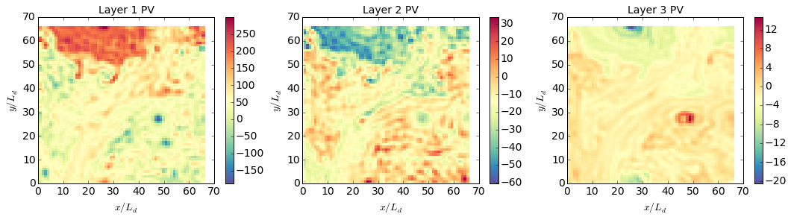

Fully developed baroclinic instability of a 3-layer flow
========================================================

.. code:: python

    import numpy as np
    from numpy import pi
    from matplotlib import pyplot as plt
    %matplotlib inline
    
    import pyqg

.. parsed-literal::

    Vendor:  Continuum Analytics, Inc.
    Package: mkl
    Message: trial mode expires in 28 days
    Vendor:  Continuum Analytics, Inc.
    Package: mkl
    Message: trial mode expires in 28 days
    Vendor:  Continuum Analytics, Inc.
    Package: mkl
    Message: trial mode expires in 28 days

Set up
======

.. code:: python

    L =  1000.e3     # length scale of box    [m]
    Ld = 15.e3       # deformation scale      [m]
    kd = 1./Ld       # deformation wavenumber [m^-1]
    Nx = 64          # number of grid points
    
    H1 = 500.        # layer 1 thickness  [m]
    H2 = 1750.       # layer 2 
    H3 = 1750.       # layer 3 
    
    U1 = 0.05          # layer 1 zonal velocity [m/s]
    U2 = 0.01         # layer 2
    U3 = 0.00         # layer 3
    
    rho1 = 1025.
    rho2 = 1025.275
    rho3 = 1025.640
    
    rek = 1.e-7       # linear bottom drag coeff.  [s^-1]
    f0  = 0.0001236812857687059 # coriolis param [s^-1]
    beta = 1.2130692965249345e-11 # planetary vorticity gradient [m^-1 s^-1]
    
    Ti = Ld/(abs(U1))  # estimate of most unstable e-folding time scale [s]
    dt = Ti/500.   # time-step [s]
    tmax = 300*Ti      # simulation time [s]

.. code:: python

    m = pyqg.LayeredModel(nx=Nx, nz=3, U = [U1,U2,U3],V = [0.,0.,0.],L=L,f=f0,beta=beta,
                             H = [H1,H2,H3], rho=[rho1,rho2,rho3],rek=rek,
                            dt=dt,tmax=tmax, twrite=5000, tavestart=Ti*300)

.. parsed-literal::

    2015-10-25 20:32:06,613 - pyqg.model - INFO -  Logger initialized
    2015-10-25 20:32:06,670 - pyqg.model - INFO -  Kernel initialized

Initial condition
=================

.. code:: python

    sig = 1.e-7
    qi = sig*np.vstack([np.random.randn(m.nx,m.ny)[np.newaxis,],
                        np.random.randn(m.nx,m.ny)[np.newaxis,],
                        np.random.randn(m.nx,m.ny)[np.newaxis,]])
    m.set_q(qi)

Run the model
=============

.. code:: python

    m.run()

.. parsed-literal::

    2015-10-25 20:32:46,444 - pyqg.model - INFO -  Step: 5000, Time: 3.000000e+06, KE: 7.839139e-07, CFL: 0.002084
    2015-10-25 20:32:53,352 - pyqg.model - INFO -  Step: 10000, Time: 6.000000e+06, KE: 1.439857e-05, CFL: 0.002605
    2015-10-25 20:33:00,359 - pyqg.model - INFO -  Step: 15000, Time: 9.000000e+06, KE: 3.883976e-04, CFL: 0.006931
    2015-10-25 20:33:07,893 - pyqg.model - INFO -  Step: 20000, Time: 1.200000e+07, KE: 3.122142e-03, CFL: 0.017894
    2015-10-25 20:33:15,486 - pyqg.model - INFO -  Step: 25000, Time: 1.500000e+07, KE: 7.713469e-03, CFL: 0.025531
    2015-10-25 20:33:22,629 - pyqg.model - INFO -  Step: 30000, Time: 1.800000e+07, KE: 1.491686e-02, CFL: 0.032567
    2015-10-25 20:33:29,571 - pyqg.model - INFO -  Step: 35000, Time: 2.100000e+07, KE: 3.278798e-02, CFL: 0.049253
    2015-10-25 20:33:36,833 - pyqg.model - INFO -  Step: 40000, Time: 2.400000e+07, KE: 5.972034e-02, CFL: 0.073931
    2015-10-25 20:33:44,503 - pyqg.model - INFO -  Step: 45000, Time: 2.700000e+07, KE: 1.055305e-01, CFL: 0.070531
    2015-10-25 20:33:51,767 - pyqg.model - INFO -  Step: 50000, Time: 3.000000e+07, KE: 1.844561e-01, CFL: 0.091489
    2015-10-25 20:33:59,218 - pyqg.model - INFO -  Step: 55000, Time: 3.300000e+07, KE: 2.817683e-01, CFL: 0.129196
    2015-10-25 20:34:06,506 - pyqg.model - INFO -  Step: 60000, Time: 3.600000e+07, KE: 4.363920e-01, CFL: 0.117921
    2015-10-25 20:34:13,741 - pyqg.model - INFO -  Step: 65000, Time: 3.900000e+07, KE: 6.416493e-01, CFL: 0.139186
    2015-10-25 20:34:21,197 - pyqg.model - INFO -  Step: 70000, Time: 4.200000e+07, KE: 8.850276e-01, CFL: 0.131505
    2015-10-25 20:34:28,358 - pyqg.model - INFO -  Step: 75000, Time: 4.500000e+07, KE: 1.157258e+00, CFL: 0.142917
    2015-10-25 20:34:35,773 - pyqg.model - INFO -  Step: 80000, Time: 4.800000e+07, KE: 1.348394e+00, CFL: 0.169216
    2015-10-25 20:34:42,977 - pyqg.model - INFO -  Step: 85000, Time: 5.100000e+07, KE: 1.414446e+00, CFL: 0.119539
    2015-10-25 20:34:50,039 - pyqg.model - INFO -  Step: 90000, Time: 5.400000e+07, KE: 1.187145e+00, CFL: 0.099308
    2015-10-25 20:34:57,540 - pyqg.model - INFO -  Step: 95000, Time: 5.700000e+07, KE: 1.003230e+00, CFL: 0.098370
    2015-10-25 20:35:04,699 - pyqg.model - INFO -  Step: 100000, Time: 6.000000e+07, KE: 8.656947e-01, CFL: 0.112893
    2015-10-25 20:35:11,775 - pyqg.model - INFO -  Step: 105000, Time: 6.300000e+07, KE: 7.799560e-01, CFL: 0.111748
    2015-10-25 20:35:18,898 - pyqg.model - INFO -  Step: 110000, Time: 6.600000e+07, KE: 6.678069e-01, CFL: 0.110277
    2015-10-25 20:35:26,230 - pyqg.model - INFO -  Step: 115000, Time: 6.900000e+07, KE: 5.451761e-01, CFL: 0.089681
    2015-10-25 20:35:33,426 - pyqg.model - INFO -  Step: 120000, Time: 7.200000e+07, KE: 4.497488e-01, CFL: 0.086001
    2015-10-25 20:35:40,560 - pyqg.model - INFO -  Step: 125000, Time: 7.500000e+07, KE: 3.749194e-01, CFL: 0.087119
    2015-10-25 20:35:47,737 - pyqg.model - INFO -  Step: 130000, Time: 7.800000e+07, KE: 3.235233e-01, CFL: 0.088282
    2015-10-25 20:35:55,229 - pyqg.model - INFO -  Step: 135000, Time: 8.100000e+07, KE: 2.801022e-01, CFL: 0.082310
    2015-10-25 20:36:02,536 - pyqg.model - INFO -  Step: 140000, Time: 8.400000e+07, KE: 3.012773e-01, CFL: 0.110713
    2015-10-25 20:36:09,822 - pyqg.model - INFO -  Step: 145000, Time: 8.700000e+07, KE: 3.281687e-01, CFL: 0.107622

A snapshot and some diagnostics
===============================

.. code:: python

    plt.figure(figsize=(18,4))
    
    plt.subplot(131)
    plt.pcolormesh(m.x/m.rd,m.y/m.rd,(m.q[0,]+m.Qy[0]*m.y)/(U1/Ld),cmap='Spectral_r')
    plt.xlabel(r'$x/L_d$')
    plt.ylabel(r'$y/L_d$')
    plt.colorbar()
    plt.title('Layer 1 PV')
    
    plt.subplot(132)
    plt.pcolormesh(m.x/m.rd,m.y/m.rd,(m.q[1,]+m.Qy[1]*m.y)/(U1/Ld),cmap='Spectral_r')
    plt.xlabel(r'$x/L_d$')
    plt.ylabel(r'$y/L_d$')
    plt.colorbar()
    plt.title('Layer 2 PV')
    
    plt.subplot(133)
    plt.pcolormesh(m.x/m.rd,m.y/m.rd,(m.q[2,]+m.Qy[2]*m.y)/(U1/Ld),cmap='Spectral_r')
    plt.xlabel(r'$x/L_d$')
    plt.ylabel(r'$y/L_d$')
    plt.colorbar()
    plt.title('Layer 3 PV')

.. parsed-literal::

    <matplotlib.text.Text at 0x1127c5c10>

.. code:: python

    kespec_1 = m.get_diagnostic('KEspec')[0].sum(axis=0)
    kespec_2 = m.get_diagnostic('KEspec')[1].sum(axis=0)
    kespec_3 = m.get_diagnostic('KEspec')[2].sum(axis=0)
    
    
    plt.loglog( m.kk, kespec_1, '.-' )
    plt.loglog( m.kk, kespec_2, '.-' )
    plt.loglog( m.kk, kespec_3, '.-' )
    
    plt.legend(['layer 1','layer 2', 'layer 3'], loc='lower left')
    plt.ylim([1e-9,1e-0]); plt.xlim([m.kk.min(), m.kk.max()])
    plt.xlabel(r'k (m$^{-1}$)'); plt.grid()
    plt.title('Kinetic Energy Spectrum');

.. image:: layered_files/layered_11_0.png

.. code:: python

    ebud = [ m.get_diagnostic('APEgenspec').sum(axis=0),
             m.get_diagnostic('APEflux').sum(axis=0),
             m.get_diagnostic('KEflux').sum(axis=0),
             -m.rek*(m.Hi[-1]/m.H)*m.get_diagnostic('KEspec')[1].sum(axis=0)*m.M**2 ]
    ebud.append(-np.vstack(ebud).sum(axis=0))
    ebud_labels = ['APE gen','APE flux div.','KE flux div.','Diss.','Resid.']
    [plt.semilogx(m.kk, term) for term in ebud]
    plt.legend(ebud_labels, loc='upper right')
    plt.xlim([m.kk.min(), m.kk.max()])
    plt.xlabel(r'k (m$^{-1}$)'); plt.grid()
    plt.title('Spectral Energy Transfers');

.. image:: layered_files/layered_12_0.png

This simple example illustrate the classic phenomenology of baroclinic
turbulence. The APE generated through baroclinic instability is fluxed
towards deformation length scales, where it is converted into KE. The KE
the experiments and inverse cascade. The mechanical bottom drag
essentially removes the large scale KE.
