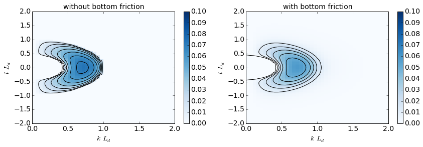
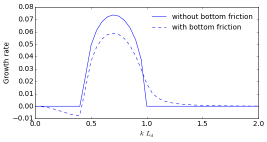
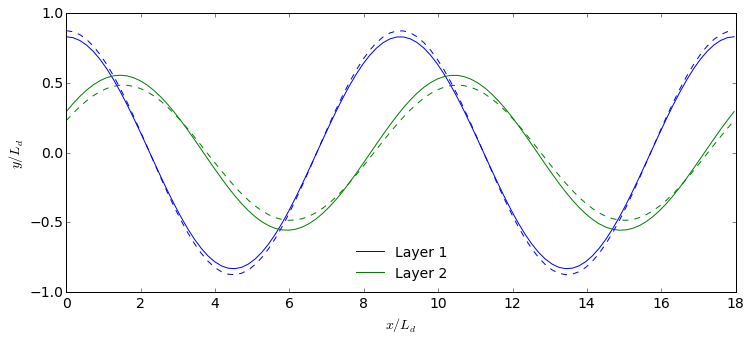

Built-in linear stability analysis
==================================

.. code:: python

    import numpy as np
    from numpy import pi
    import matplotlib.pyplot as plt
    %matplotlib inline
    
    import pyqg

.. code:: python

    m = pyqg.LayeredModel(nx=256, nz = 2, U = [.01, -.01], V = [0., 0.], H = [1., 1.],
                                  L=2*pi,beta=1.5, rd=1./20., rek=0.05, f=1.,delta=1.)

.. parsed-literal::

    INFO:  Logger initialized
    INFO:  Kernel initialized

To perform linear stability analysis, we simply call pyqg's built-in
method ``stability_analysis``:

.. code:: python

    m.stability_analysis()

The eigenvalues are stored in ``omg``, and the eigenctors in ``evec``.
For plotting purposes, we use fftshift to reorder the entries

.. code:: python

    omg = np.fft.fftshift(m.omg.imag,axes=(0,))
    
    k,l = m.k*m.radii[1], np.fft.fftshift(m.l,axes=(0,))*m.radii[1]

It is also useful to analyze the fasted-growing mode:

.. code:: python

    argmax = omg[m.Ny/2,:].argmax()
    evec = np.fft.fftshift(m.evec,axes=(1))[:,m.Ny/2,argmax]
    kmax = k[m.Ny/2,argmax]
    
    x = np.linspace(0,4.*pi/kmax,100)
    mag, phase = np.abs(evec), np.arctan2(evec.imag,evec.real) 

By default, the stability analysis above is performed without bottom
friction, but the stability method also supports bottom friction:

.. code:: python

    m.stability_analysis(bottom_friction=True)
    omg_fric = np.fft.fftshift(m.omg.imag,axes=(0,))
    
    argmax = omg_fric[m.Ny/2,:].argmax()
    evec_fric = np.fft.fftshift(m.evec,axes=(1))[:,m.Ny/2,argmax]
    kmax_fric = k[m.Ny/2,argmax]
    
    mag_fric, phase_fric = np.abs(evec_fric), np.arctan2(evec_fric.imag,evec_fric.real) 

Plotting growth rates
=====================

.. code:: python

    plt.figure(figsize=(14,4))
    plt.subplot(121)
    plt.contour(k,l,omg,colors='k')
    plt.pcolormesh(k,l,omg,cmap='Blues')
    plt.colorbar()
    plt.xlim(0,2.); plt.ylim(-2.,2.)
    plt.clim([0.,.1])
    plt.xlabel(r'$k \, L_d$'); plt.ylabel(r'$l \, L_d$') 
    plt.title('without bottom friction')
    
    plt.subplot(122)
    plt.contour(k,l,omg_fric,colors='k')
    plt.pcolormesh(k,l,omg_fric,cmap='Blues')
    plt.colorbar()
    plt.xlim(0,2.); plt.ylim(-2.,2.)
    plt.clim([0.,.1])
    plt.xlabel(r'$k \, L_d$'); plt.ylabel(r'$l \, L_d$') 
    plt.title('with bottom friction')

.. parsed-literal::

    <matplotlib.text.Text at 0x11602de10>

.. code:: python

    plt.figure(figsize=(8,4))
    plt.plot(k[m.Ny/2,:],omg[m.Ny/2,:],'b',label='without bottom friction')
    plt.plot(k[m.Ny/2,:],omg_fric[m.Ny/2,:],'b--',label='with bottom friction')
    plt.xlim(0.,2.)
    plt.legend()
    plt.xlabel(r'$k\,L_d$')
    plt.ylabel(r'Growth rate')

.. parsed-literal::

    <matplotlib.text.Text at 0x11742a090>

Plotting the wavestructure of the most unstable modes
=====================================================

.. code:: python

    plt.figure(figsize=(12,5))
    plt.plot(x,mag[0]*np.cos(kmax*x + phase[0]),'b',label='Layer 1')
    plt.plot(x,mag[1]*np.cos(kmax*x + phase[1]),'g',label='Layer 2')
    plt.plot(x,mag_fric[0]*np.cos(kmax_fric*x + phase_fric[0]),'b--')
    plt.plot(x,mag_fric[1]*np.cos(kmax_fric*x + phase_fric[1]),'g--')
    plt.legend(loc=8)
    plt.xlabel(r'$x/L_d$'); plt.ylabel(r'$y/L_d$')

.. parsed-literal::

    <matplotlib.text.Text at 0x11993d990>

This calculation shows the classic phase-tilting of baroclinic unstable
waves (e.g. `Vallis 2006 <http://www.vallisbook.org>`__ ).

