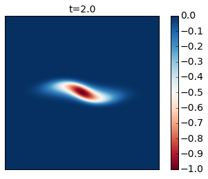
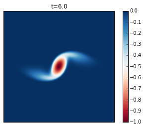
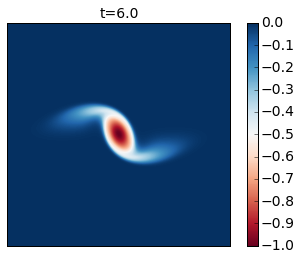
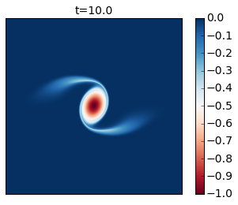
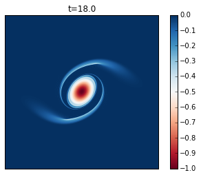
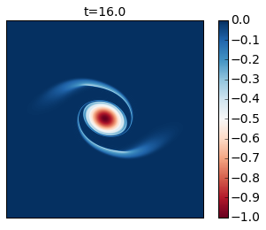
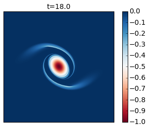
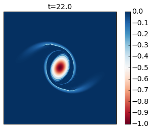
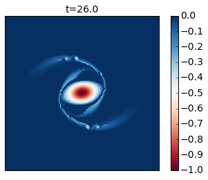

Surface Quasi-Geostrophic (SQG) Model
=====================================

Here will will use pyqg to reproduce the results of the paper: I. M.
Held, R. T. Pierrehumbert, S. T. Garner and K. L. Swanson (1985).
Surface quasi-geostrophic dynamics. Journal of Fluid Mechanics, 282, pp
1-20 [doi:: http://dx.doi.org/10.1017/S0022112095000012)

.. code:: python

    import matplotlib.pyplot as plt
    import numpy as np
    from numpy import pi
    %matplotlib inline
    from pyqg import sqg_model

.. parsed-literal::

    Vendor:  Continuum Analytics, Inc.
    Package: mkl
    Message: trial mode expires in 21 days
    Vendor:  Continuum Analytics, Inc.
    Package: mkl
    Message: trial mode expires in 21 days
    Vendor:  Continuum Analytics, Inc.
    Package: mkl
    Message: trial mode expires in 21 days

Surface quasi-geostrophy (SQG) is a relatively simple model that
describes surface intensified flows due to buoyancy. One of it's
advantages is that it only has two spatial dimensions but describes a
three-dimensional solution.

If we define :math:`b` to be the buoyancy, then the evolution equation
for buoyancy at each the top and bottom surface is

.. math::

   \partial_t b + J(\psi, b) = 0.

The invertibility relation between the streamfunction, :math:`\psi`, and
the buoyancy, :math:`b`, is hydrostatic balance

.. math::

   b = \partial_z \psi. 

Using the fact that the Potential Vorticity is exactly zero in the
interior of the domain and that the domain is semi-infinite, yields that
the inversion in Fourier space is,

.. math::

   \hat b = \frac{\kappa N}{f_0} \hat \psi.

Held et al. studied several different cases, the first of which was the
nonlinear evolution of an elliptical vortex. There are several other
cases that they studied and people are welcome to adapt the code to
study those as well. But here we focus on this first example for
pedagogical reasons.

.. code:: python

    # create the model object
    year = 1.
    m = sqg_model.SQGModel(L=2.*pi,nx=512, tmax = 26.005,
            beta = 0., Nb = 1., H = 1., f_0 = 0., dt = 0.005,
                         taveint=1, twrite=400, ntd=4)
    # in this example we used ntd=4, four threads
    # if your machine has more (or fewer) cores available, you could try changing it

.. parsed-literal::

    INFO:  Logger initialized
    INFO:  Kernel initialized

Initial condition
-----------------

The initial condition is an elliptical vortex,

.. math::

   b = 0.01 \exp( - (x^2 + (4y)^2)/(L/y)^2

where :math:`L` is the length scale of the vortex in the :math:`x`
direction. The amplitude is 0.01, which sets the strength and speed of
the vortex. The aspect ratio in this example is :math:`4` and gives rise
to an instability. If you reduce this ratio sufficiently you will find
that it is stable. Why don't you try it and see for yourself?

.. code:: python

    # Choose ICs from Held et al. (1995)
    # case i) Elliptical vortex
    x = np.linspace(m.dx/2,2*np.pi,m.nx) - np.pi
    y = np.linspace(m.dy/2,2*np.pi,m.ny) - np.pi
    x,y = np.meshgrid(x,y)
    
    qi = -np.exp(-(x**2 + (4.0*y)**2)/(m.L/6.0)**2)

.. code:: python

    # initialize the model with that initial condition
    m.set_q(qi[np.newaxis,:,:])

.. code:: python

    # Plot the ICs
    plt.rcParams['image.cmap'] = 'RdBu'
    plt.clf()
    p1 = plt.imshow(m.q.squeeze() + m.beta * m.y)
    plt.title('b(x,y,t=0)')
    plt.colorbar()
    plt.clim([-1, 0])
    plt.xticks([])
    plt.yticks([])
    plt.show()

.. parsed-literal::

    /Users/crocha/anaconda/lib/python2.7/site-packages/matplotlib/collections.py:590: FutureWarning: elementwise comparison failed; returning scalar instead, but in the future will perform elementwise comparison
      if self._edgecolors == str('face'):

.. image:: sqg_files/sqg_11_1.png

Runing the model
----------------

Here we demonstrate how to use the ``run_with_snapshots`` feature to
periodically stop the model and perform some action (in this case,
visualization).

.. code:: python

    for snapshot in m.run_with_snapshots(tsnapstart=0., tsnapint=400*m.dt):
        plt.clf()
        p1 = plt.imshow(m.q.squeeze() + m.beta * m.y)
        #plt.clim([-30., 30.])
        plt.title('t='+str(m.t))
        plt.colorbar()
        plt.clim([-1, 0])
        plt.xticks([])
        plt.yticks([])
        plt.show()

.. parsed-literal::

    INFO: Step: 400, Time: 2.00e+00, KE: 5.21e-03, CFL: 0.245

.. parsed-literal::

    INFO: Step: 800, Time: 4.00e+00, KE: 5.21e-03, CFL: 0.239

.. parsed-literal::

    INFO: Step: 1200, Time: 6.00e+00, KE: 5.21e-03, CFL: 0.261

.. parsed-literal::

    INFO: Step: 1600, Time: 8.00e+00, KE: 5.21e-03, CFL: 0.273

.. parsed-literal::

    INFO: Step: 2000, Time: 1.00e+01, KE: 5.21e-03, CFL: 0.267

.. parsed-literal::

    INFO: Step: 2400, Time: 1.20e+01, KE: 5.20e-03, CFL: 0.247

.. parsed-literal::

    INFO: Step: 2800, Time: 1.40e+01, KE: 5.20e-03, CFL: 0.254

.. image:: sqg_files/sqg_13_13.png

.. parsed-literal::

    INFO: Step: 3200, Time: 1.60e+01, KE: 5.20e-03, CFL: 0.259

.. parsed-literal::

    INFO: Step: 3600, Time: 1.80e+01, KE: 5.19e-03, CFL: 0.256

.. parsed-literal::

    INFO: Step: 4000, Time: 2.00e+01, KE: 5.19e-03, CFL: 0.259

.. image:: sqg_files/sqg_13_19.png

.. parsed-literal::

    INFO: Step: 4400, Time: 2.20e+01, KE: 5.19e-03, CFL: 0.259

.. parsed-literal::

    INFO: Step: 4800, Time: 2.40e+01, KE: 5.18e-03, CFL: 0.242

.. image:: sqg_files/sqg_13_23.png

.. parsed-literal::

    INFO: Step: 5200, Time: 2.60e+01, KE: 5.17e-03, CFL: 0.263

Compare these results with Figure 2 of the paper. In this simulation you
see that as the cyclone rotates it develops thin arms that spread
outwards and become unstable because of their strong shear. This is an
excellent example of how smaller scale vortices can be generated from a
mesoscale vortex.

You can modify this to run it for longer time to generate the analogue
of their Figure 3.

