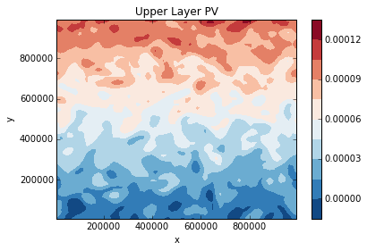
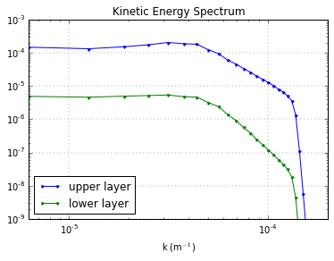
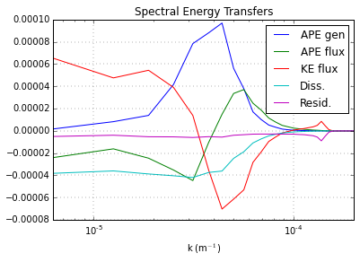

Two Layer QG Model Example
==========================

Here is a quick overview of how to use the two-layer model. See the
:py:class:`pyqg.QGModel` api documentation for further details.

First import numpy, matplotlib, and pyqg:

.. code:: python

    import numpy as np
    from matplotlib import pyplot as plt
    %matplotlib inline
    import pyqg

Initialize and Run the Model
----------------------------

Here we set up a model which will run for 10 years and start averaging
after 5 years. There are lots of parameters that can be specified as
keyword arguments but we are just using the defaults.

.. code:: python

    year = 24*60*60*360.
    m = pyqg.QGModel(tmax=10*year, twrite=10000, tavestart=5*year)
    m.run()

.. parsed-literal::

    t=        72000000, tc=     10000: cfl=0.081583, ke=0.000301118
    t=       144000000, tc=     20000: cfl=0.105460, ke=0.000515485
    t=       216000000, tc=     30000: cfl=0.087645, ke=0.000458610
    t=       288000000, tc=     40000: cfl=0.082984, ke=0.000541443

Visualize Output
----------------

We access the actual pv values through the attribute ``m.q``. The first
axis of ``q`` corresponds with the layer number. (Remeber that in
python, numbering starts at 0.)

.. code:: python

    q_upper = m.q[0] + m.Qy[0]*m.y
    plt.contourf(m.x, m.y, q_upper, 12, cmap='RdBu_r')
    plt.xlabel('x'); plt.ylabel('y'); plt.title('Upper Layer PV')
    plt.colorbar();

Plot Diagnostics
----------------

The model automatically accumulates averages of certain diagnostics. We
can find out what diagnostics are available by calling

.. code:: python

    m.describe_diagnostics()

.. parsed-literal::

    NAME       | DESCRIPTION
    --------------------------------------------------------------------------------
    APEflux    | spectral flux of available potential energy           
    APEgen     | total APE generation                                  
    APEgenspec | spectrum of APE generation                            
    EKE        | mean eddy kinetic energy                              
    EKEdiss    | total energy dissipation by bottom drag               
    Ensspec    | enstrophy spectrum                                    
    KEflux     | spectral flux of kinetic energy                       
    KEspec     |  kinetic energy spectrum                              
    entspec    | barotropic enstrophy spectrum                         
    q          | QGPV                                                  

To look at the wavenumber energy spectrum, we plot the ``KEspec``
diagnostic. (Note that summing along the l-axis, as in this example,
does not give us a true *isotropic* wavenumber spectrum.)

.. code:: python

    kespec_u = m.get_diagnostic('KEspec')[0].sum(axis=0)
    kespec_l = m.get_diagnostic('KEspec')[1].sum(axis=0)
    plt.loglog( m.kk, kespec_u, '.-' )
    plt.loglog( m.kk, kespec_l, '.-' )
    plt.legend(['upper layer','lower layer'], loc='lower left')
    plt.ylim([1e-9,1e-3]); plt.xlim([m.kk.min(), m.kk.max()])
    plt.xlabel(r'k (m$^{-1}$)'); plt.grid()
    plt.title('Kinetic Energy Spectrum');

We can also plot the spectral fluxes of energy.

.. code:: python

    ebud = [ -m.get_diagnostic('APEgenspec').sum(axis=0),
             -m.get_diagnostic('APEflux').sum(axis=0),
             -m.get_diagnostic('KEflux').sum(axis=0),
             -m.rek*m.del2*m.get_diagnostic('KEspec')[1].sum(axis=0)*m.M**2 ]
    ebud.append(-np.vstack(ebud).sum(axis=0))
    ebud_labels = ['APE gen','APE flux','KE flux','Diss.','Resid.']
    [plt.semilogx(m.kk, term) for term in ebud]
    plt.legend(ebud_labels, loc='upper right')
    plt.xlim([m.kk.min(), m.kk.max()])
    plt.xlabel(r'k (m$^{-1}$)'); plt.grid()
    plt.title('Spectral Energy Transfers');

