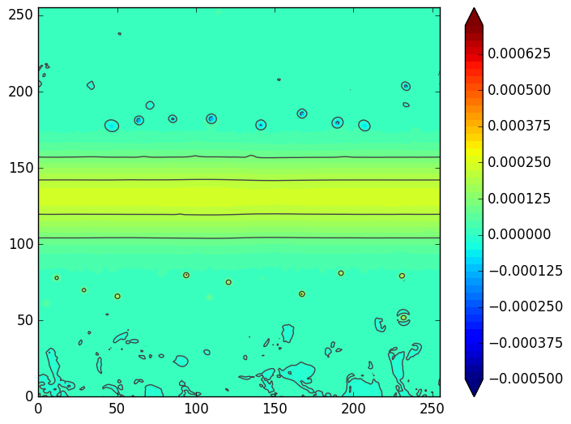
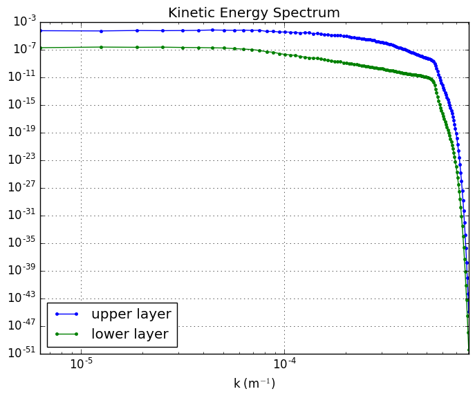
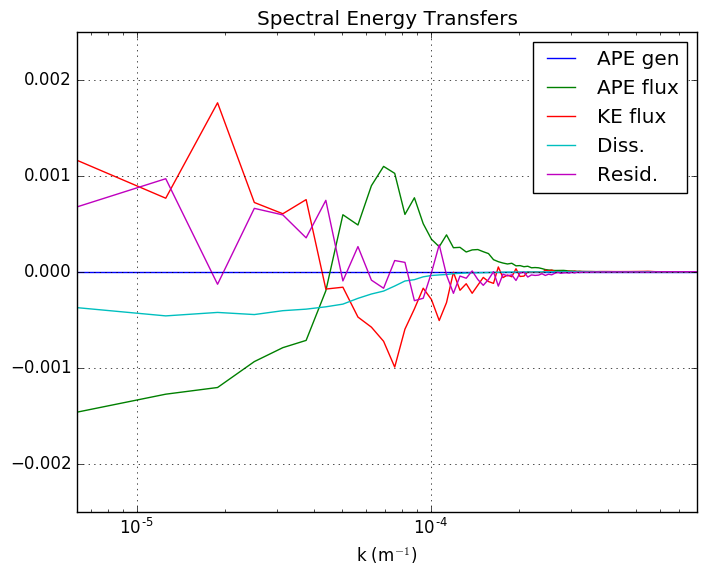

Zonal Jet QG Feature Example
============================

Here is a quick overview of how to use the zonal jet feature. The zonal jet
feature is available in all PyQG models, but in this example we use the QG Model.
See the :py:class:``pyqg.QGModel`` api documentation for further details.

First import numpy, matplotlib, and pyqg:

.. code:: python

    import numpy as np
    from matplotlib import pyplot as plt
    import pyqg
    from pyqg.diagnostic_tools import spec_var

Initialize and Run the Model
----------------------------

We define initial conditions where the upper layer currents are zonally uniform
and have a Gaussian jet centered on the domain, with the flow in the lower layer
being of half the magnitude as in the upper.

.. code:: python

    a = 0.25
    c=20.
    nx = 256.
    b=nx/2.
    U1 = 0.0 + a * np.exp(-((np.arange(nx,dtype=float)-b)**2)/(2*c**2))
    U2 = U1 / 2.0

We then set up a model which will run for 10 years and start averaging
after 5 years. The model is also seeded with random perturbations to its
potential vorticity to generate a reasonably uniform distribution of eddies.

.. code:: python

    year = 24*60*60*360.
    m = pyqg.QGModel(tavestart=5*year,  dt=500, tmax=10*year, U1=U1,U2=U2, nx=nx)
    fk = m.wv != 0
    ckappa = np.zeros_like(m.wv2)
    ckappa[fk] = np.sqrt( m.wv2[fk]*(1. + (m.wv2[fk]/36.)**2) )**-1

    nhx,nhy = m.wv2.shape

    Pi_hat = np.random.randn(nhx,nhy)*ckappa +1j*np.random.randn(nhx,nhy)*ckappa

    Pi = m.ifft( Pi_hat[np.newaxis] )
    Pi = Pi - Pi.mean()
    Pi_hat = m.fft( Pi )
    KEaux = spec_var( m, m.filtr*m.wv*Pi_hat )

    pih = ( Pi_hat/np.sqrt(KEaux[:,np.newaxis,np.newaxis]) )
    qih = -m.wv2*pih
    qi = m.ifft(qih)
    m.set_q(qi)
    m.run()

.. parsed-literal::

    t=        72000000, tc=     10000: cfl=0.105787, ke=0.000565075
    t=       144000000, tc=     20000: cfl=0.092474, ke=0.000471924
    t=       216000000, tc=     30000: cfl=0.104418, ke=0.000525463
    t=       288000000, tc=     40000: cfl=0.089834, ke=0.000502072

Visualize Output
----------------

We access the actual pv values through the attribute ``m.q``. The first
axis of ``q`` corresponds with the layer number. (Remeber that in
python, numbering starts at 0.). We then add the calculated PV of the background
current to the planetary PV.

.. code:: python

    Q1 = np.expand_dims(m.Qy1 - np.gradient(np.gradient(m.U1, m.dy), m.dy), axis=1) * m.y + np.gradient(m.U1, m.dy)
    clevels = np.arange(-0.0005, 0.00075, 0.000025)
    levels = np.arange(-0.0005,0.0008,0.0001)
    f = plt.contourf(Q1 + m.q[0,:],levels=clevels, extend='both')
    plt.contour(Q1 + m.q[0,:],levels=levels, extend='both', colors='#444444')
    plt.clim([-0.0005,0.00075])
    plt.colorbar(f)

Plot Diagnostics
----------------

The model automatically accumulates averages of certain diagnostics. We
can find out what diagnostics are available by calling

.. code:: python

    m.describe_diagnostics()

.. parsed-literal::

    NAME       | DESCRIPTION
    --------------------------------------------------------------------------------
    APEflux    | spectral flux of available potential energy           
    APEgen     | total APE generation                                  
    APEgenspec | spectrum of APE generation                            
    EKE        | mean eddy kinetic energy                              
    EKEdiss    | total energy dissipation by bottom drag               
    Ensspec    | enstrophy spectrum                                    
    KEflux     | spectral flux of kinetic energy                       
    KEspec     |  kinetic energy spectrum                              
    entspec    | barotropic enstrophy spectrum                         
    q          | QGPV                                                  

To look at the wavenumber energy spectrum, we plot the ``KEspec``
diagnostic. (Note that summing along the l-axis, as in this example,
does not give us a true *isotropic* wavenumber spectrum.)

.. code:: python

    kespec_u = m.get_diagnostic('KEspec')[0].sum(axis=0)
    kespec_l = m.get_diagnostic('KEspec')[1].sum(axis=0)
    plt.loglog( m.kk, kespec_u, '.-' )
    plt.loglog( m.kk, kespec_l, '.-' )
    plt.legend(['upper layer','lower layer'], loc='lower left')
    plt.ylim([1e-9,1e-3]); plt.xlim([m.kk.min(), m.kk.max()])
    plt.xlabel(r'k (m$^{-1}$)'); plt.grid()
    plt.title('Kinetic Energy Spectrum');

We can also plot the spectral fluxes of energy.

.. code:: python

    ebud = [ m.get_diagnostic('APEgenspec').sum(axis=0),
             m.get_diagnostic('APEflux').sum(axis=0),
             m.get_diagnostic('KEflux').sum(axis=0),
             -m.rek*m.del2*m.get_diagnostic('KEspec')[1].sum(axis=0)*m.M**2 ]
    ebud.append(-np.vstack(ebud).sum(axis=0))
    ebud_labels = ['APE gen','APE flux','KE flux','Diss.','Resid.']
    [plt.semilogx(m.kk, term) for term in ebud]
    plt.legend(ebud_labels, loc='upper right')
    plt.xlim([m.kk.min(), m.kk.max()])
    plt.xlabel(r'k (m$^{-1}$)'); plt.grid()
    plt.title('Spectral Energy Transfers');

